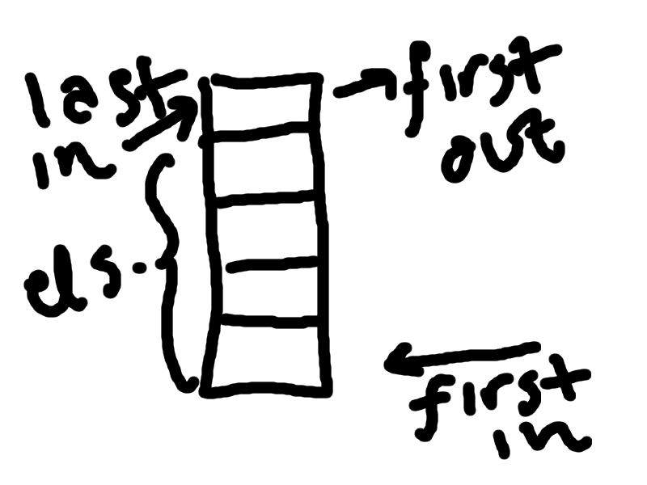
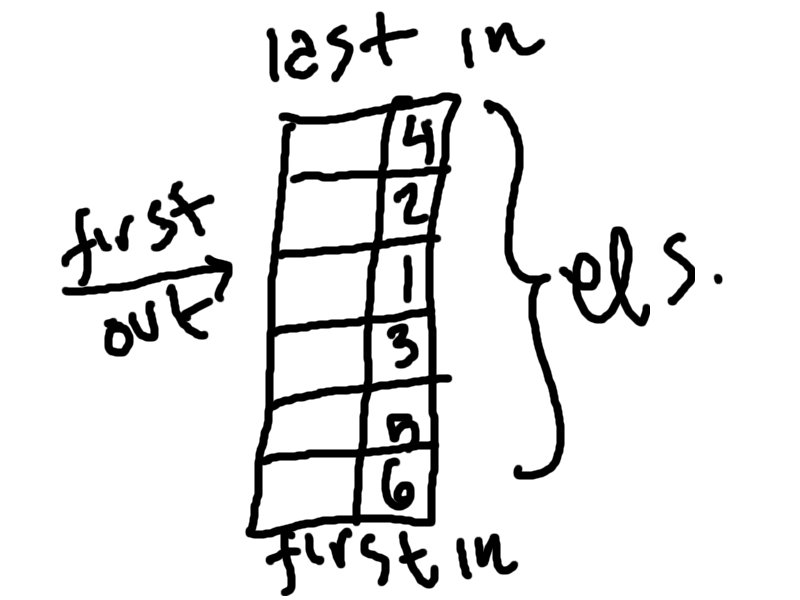
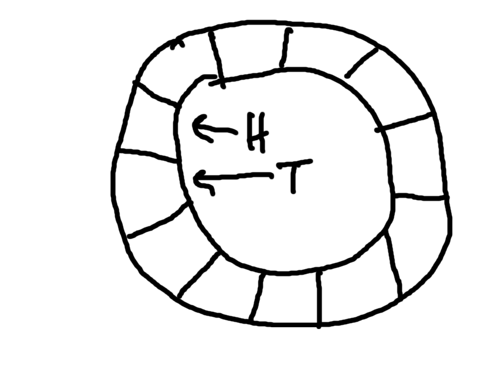
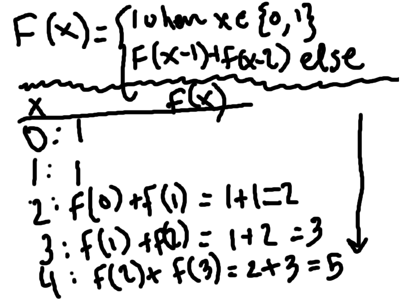

Name: Max Bernstein & Chris Hinstorff 
Period: 2

*Queue*
* Superclass
  * Collection
* Meaning
  * Designed for holding elements prior to processing (according to javadoc). Normally FIFO.
* Picture
  * 
  
*Stack*
* Superclass
  * Vector
* Meaning
  * It's a LIFO way of holding elements. Simple pop/push, etc. Works exactly like a tower of books. Don't try and pull from the middle.
* Picture
  * 

*Priority Queue*
* Superclass
  * AbstractQueue
* Meaning
  * A queue in which each element has a designated "priority" by which it is pulled out.
* Picture
  * 

*Circular Queue*
* Superclass
  * It does not appear to exist in Java natively, but one could extend AbstractQueue, most likely.
* Meaning
  * The tail (T) and head (H) of the queue are next to each other, such that when iterating over the queue the iterator goes from H-&gt;T and T-&gt;H.
* Picture
  * 

*Recursion*
* Definition
  * Repeated application of a method within the method itself, generally on different data.
* Necessary Elements
  * Base case
  * Conditions for action past the base case
* Fibonacci method
  * <pre>
  long int fibonacci(int n) {
  &nbsp;&nbsp;if (n <= 1) return 1;
  &nbsp;&nbsp;else return fibonacci(n-1)+fibonacci(n-2);
  }
  </pre>
* Picture
  * 

*Tree*
* Meaning
  * A collection of nodes, each possibly with linked nodes of its own.

*Binary Tree*
* Meaning
  * A tree where each node has at most two linked nodes, or "children".
* Traversal
  * One can traverse depth first or breadth first. Depth first visits the "bottom"-most node first, then works its way back up and around the tree by recursively applying that to the other branches. Breadth first visits "level" by "level", or by visiting the nearest node each time.
* Three types
  * Full
  * Complete
  * Search

*Binary Search Tree*
* Meaning
  * Sorted binary tree where:
    * Left subtree of a node has only nodes with smaller values than the node itself
    * Right subtree of a node has only nodes with greater values than the node itself
    * Left & Right subtrees must also be binary search trees
    * There are no duplicate nodes
* Program 1
  * 
* Program 2
  * 

*Complete Binary Tree*
* Meaning
  * 

*Full Binary Tree*
* Meaning
  * 

*TreeSet*
* Meaning
  * 

*TreeMap*
* Meaning
  * 
