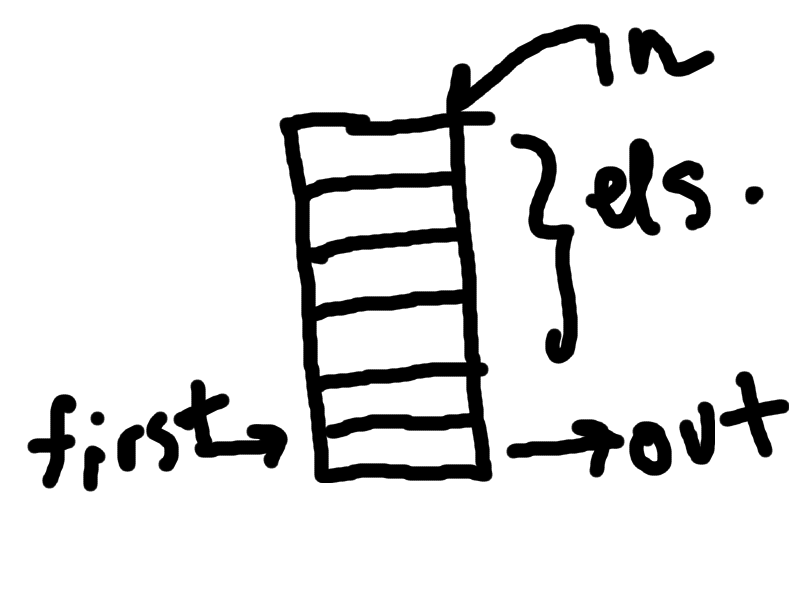

Name: Max Bernstein & Chris Hinstorff 
Period: 2

*Queue*
* Superclass
  * Collection
* Meaning
  * Designed for holding elements prior to processing (according to javadoc). Normally FIFO.
* Picture
  * 
  
*Stack*
* Superclass

* Meaning

* Picture
  * 

*Priority Queue*
* Superclass

* Meaning

* Picture
  * 

*Circular Queue*
* Superclass

* Meaning

* Picture
  * 

*Recursion*
* Definition

* Necessary Elements

* Fibonacci method
  * <pre> </pre>

* Picture
  * 
